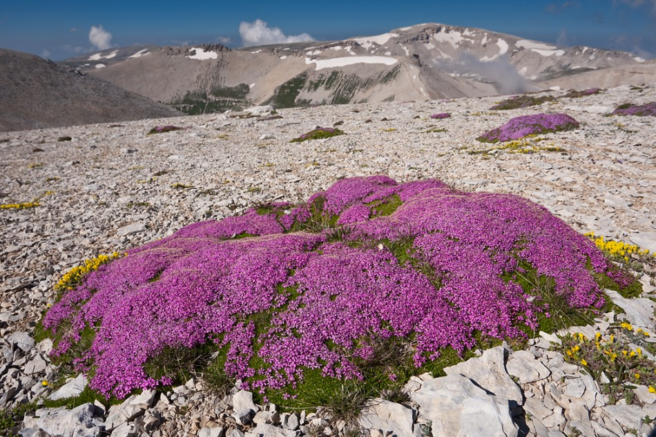

---
title:
author: "cjlortie"
date: "2017"
output:
  html_document:
    theme: spacelab
    toc: yes
    toc_depth: 3
    toc_float: yes
  pdf_document:
    toc: yes
---
<br>

<br>

#Global cushion dataset
###Purpose
To explore the importance of cushion-forming plant species as foundation species in the alpine.

###Meta-data  
A set of data collected by ecologists globally at their respective alpine study sites. Sampling was structured using the dominant plant species at high-elevation meadows. The dominant lifeform used was cushion-forming, and association patterns of the local plant species with cushions relative to 'open' microsites were recorded.

###Meta-data-QA
```{r, meta-data, warning=FALSE, message=FALSE, cache=TRUE}
library(tidyverse)
#meta-data check
meta.data <- read_csv("data/cushion_site_metadata.csv")
meta.data

require(maps)
world<-map_data("world")
map<-ggplot() + geom_polygon(data=world, fill="gray50", aes(x=long, y=lat, group=group))
map + geom_point(data=meta.data, aes(x=long, y=lat)) + labs(x = "longitude", y = "latitude")

```

###Data-QA
```{r, data, warning=FALSE, message=FALSE, cache=TRUE}
#data
data <- read_csv("data/global_cushion_community_data.csv")

#quick check
#library(devtools)
#devtools::install_github("hadley/colformat")
#devtools::install_github("ropenscilabs/skimr")
#view summary stats across entire df
library(skimr)
d <- skim(data)
d

#wrangle by microsite and by species
#get row sums
data <- data %>% mutate(totals = rowSums(.[5:1038]))

#group by microsite
micro <- data %>% group_by(ID, microsite) %>% summarise(total.ab = sum(totals), sd.ab = sd(totals), mean.ab = mean(totals), se = sd(totals)/sqrt(length(totals)))

#group by species
species <-  data %>% select(-cushion_sp, -sample) %>%  group_by(ID, microsite) %>% summarise_all(funs(sum))

species <- data %>% select(-cushion_sp, -sample) %>%  group_by(ID, microsite) %>% summarise_all(sum)


```
